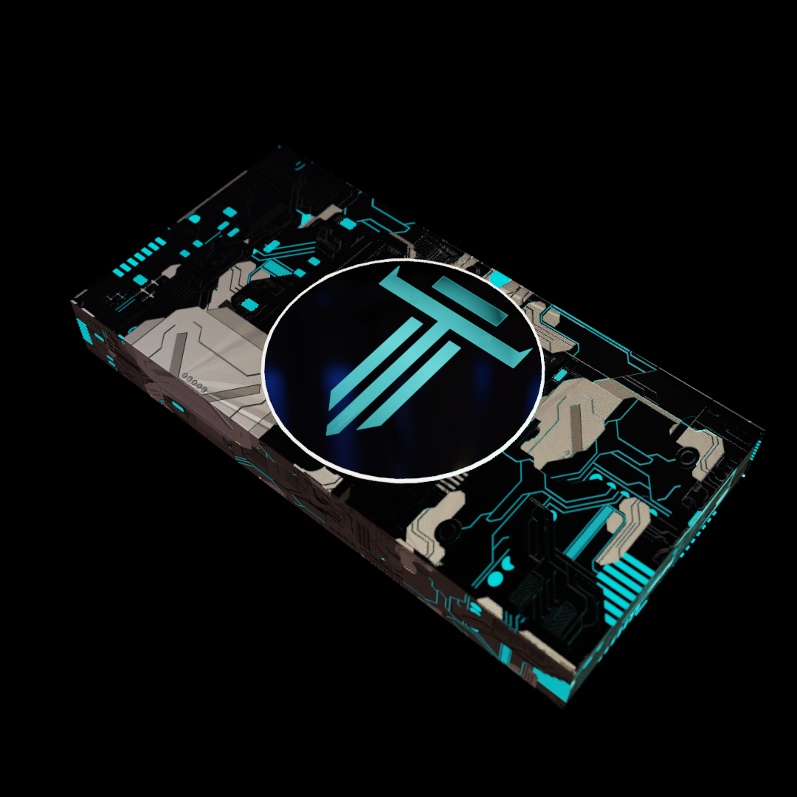

# 🚀 DigiLaunch

## Phase 0: The DigiKey

DigiKeys NFTs will serve as the mechanism through which we provide initial liquidity and funding for the Telesto Protocols. All DigiKey NFT holders will be airdropped TELO in proportion to the amount of NFTS they hold when snapshots are taken 48 hours after the mint page is live (limit 5 per person).

1,000 DigiKeys will be minted on Aurora and 1,000 on Ethereum.&#x20;

The Initial mint price of $500 PER nft to be paid for in ETH (ETH is also the base currency on Aurora although gas/tx's are much cheaper). Minting on Aurora and Ethereum will give provide ethereum users a chance to check out Aurora, a more efficient, cheaper and eco-friendly EVM that runs on top of Near protocol.&#x20;

Those that have already whitelisted will receive a 16% discount for a total of $420 per NFT.&#x20;

We recommend [Rainbow Bridge](https://rainbowbridge.app) to bridge assets between ETHEREUM <> AURORA <> NEAR. Check out the[ "How To Guides"](broken-reference) section for some more information.

Transactions between Near and Aurora are near instant and very cheap, while you will have to pay a gas fee for going on and off Ethereum.

[Trisolaris](https://www.trisolaris.io/#/swap) is the highest volume exchange on Aurora and also has a Bridges section with options from Terra and other chains.

 (1) (1).png>)

## Distribution of launch sale funds

The launch sale will result in approximately $992,000 if all DigiKeys are minted. This number is subject to change if less whitelisters show up for the sale, or the collection does not sell out.

84% of the funds generated from the launch sale will go directly into providing initial liquidity for to the Telesto Finance DAO, backing $TELO and starting the Genesis Pools.

14% will given to the development fund to start the immediate development of Telesto World.

2% will be given to Amazon Watch.

Amazon Watch fights the destruction of the Amazon, supports Indigenous rights, and finds climate justice solutions.&#x20;

It also happens to be [Lil Nas X’s charity of choice](https://twitter.com/LilNasX/status/1164346740041867264) for saving the Amazon.&#x20;

This will result in $833,280 for the Telesto Finance Protocol and $138,880 to fund the development of Telesto World and $19,840 to Amazon Watch. To truly get this project off the ground and have the development of Telesto World DigiWorld Metaverse realized in a reasonable amount of time, we see this as the best course of action for investors, supporters and team alike.&#x20;

The initial minting of TELO, as well as the launch of the protocol, is to occur before February 1st, 2022 and all DigiKey holders will be airdropped their portion of TELO.

\*IMPORTANT\*.&#x20;

**We will be taking a snapshot approximately 48 hours after the DigiKey minting goes live at 1/28/2022 UTC 0:00. This snapshot will determine who is eligible for the TELO airdrop.**

Anyone who has a NFT in their wallet will be eligible for their portion of TELO tokens. Since TELO is pegged to the price of NEAR at a 10:1 ratio, the amount of tokens distributed will be dynamically adjusted depending on market prices. For example, with current conditions would $400 worth of TELO would be approximately 259 TELO tokens since NEAR is currently at $15.42 USD and thus TELO would be pegged at $1.54.

We will airdrop all NFT holders their portion of TELO in the days following the snapshot and start the protocol shortly after. We wish to remain vague on the timing of the launch of the protocols in order to retain a competitive advantage and to ensure fairness (aka stealth launch). Whitelisters will be the first to be notified.

