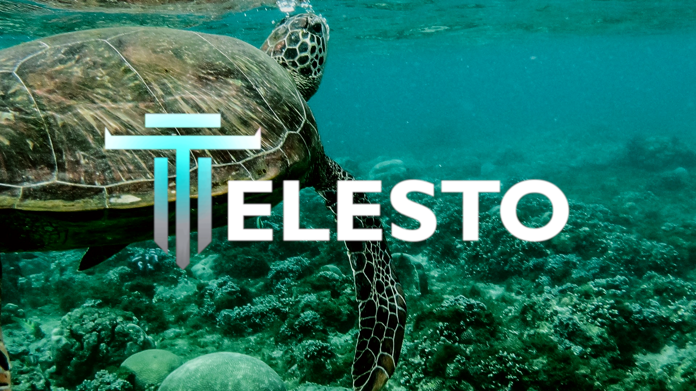

# 💻 Meet the Devs

[Stuart Gardner](https://www.linkedin.com/in/stuarttgardner/), Co-founder, also know as Satyrn is a developer and artist with over 4 years development experience with several frontend and backend frameworks. He is also a 3D artist and Blender fanatic currently living in Brasil. .

.jpg>)

[Abhi Tiwari](https://www.linkedin.com/in/abhi-kay-tiwari/) is a full time software developer, digital marketer, and semi co-founder who goes by "Mars" in the Discord.&#x20;

Jupityr, who wishes to remain anonymous, is a software developer with over 10 years of experience who has participated in many hackathons under different pseudonyms. He is often active in the Discord, is a successful NFT artist/developer, and is very approachable with a sense of humor. The "shadowy supercoder" of Telesto.

.png>)
