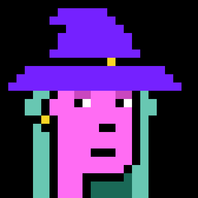
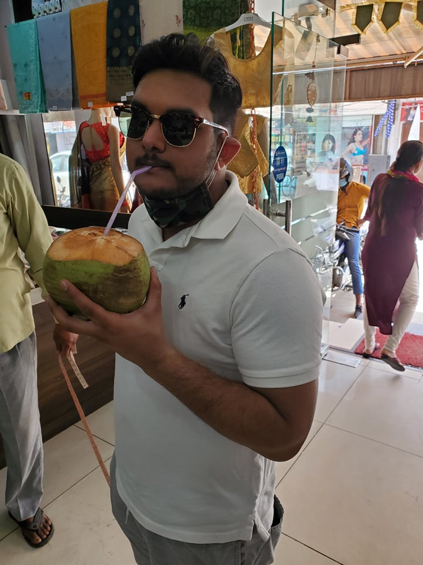

# 🌴 Meet the Devs

For sake of transparency, Telesto will respect the wishes of each individual developer and honor their wish to doxx or to remain anonymous. Thus, we will, for the time being, have a mixture of doxxed and undoxxed developers.

 (1).jpeg>)

Jupityr, Co-founder, is a software developer with over 10 years of experience in developing enterprise-level and personal projects and has shipped several successful apps on both the Apple and Google Play store. Jupityr is also a successful NFT artist and Developer within the larger crypto community.&#x20;

[Stuart Gardner](https://www.linkedin.com/in/stuarttgardner/), Co-founder, also know as Satyrn is a developer and artist with over 4 years development experience with several frontend and backend frameworks. He is also a 3D artist and Blender fanatic currently living in Brasil.

.jpg>)

[Abhi Tiwari](https://www.linkedin.com/in/abhi-kay-tiwari/) is a full time software developer, digital marketer, and semi co-founder who goes by "Mars" in the Discord.&#x20;

