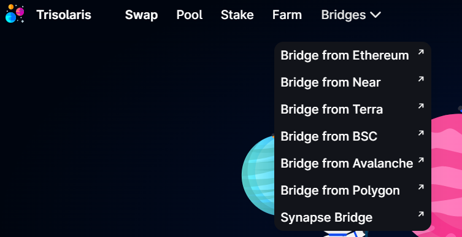

# 🌉 Bridging Assets

For Bridging Assets between Ethereum <> Aurora <> Near you can use [Rainbow Bridge](https://rainbowbridge.app).&#x20;

.png>)

Transactions between Near and Aurora will be practically instant and very low in tx fee. Transactions on and off from Ethereum will take longer and be higher in tx fee due to the nature of Ethereum. Near/Aurora attempts to solve these network congestion issues and does it very well so we recommend it! Aurora makes it easy by making the base currency used to pay transactions in ETH.

There are also other bridging options available for Aurora and [Trisolaris](https://www.trisolaris.io/#/swap) is a DEX we recommend on Aurora that has the highest liquidity for swapping between various assets and also for showcasing different bridging options.

Another approach still, is to set up a [Near wallet](https://wallet.near.org), if you do not yet have one. You can onboard through [Moonpay](https://buy.moonpay.com/?apiKey=pk\_live\_jYDdkGL7bJsrwalHZs1lVIhdOHOtK8BR\&walletAddress=satyrn.near\&currencyCode=NEAR\&redirectURL=https%3A%2F%2Fwallet.near.org\&signature=U6kNC%2BfEmc1c9wByXjPoW8%2BwLDAfbAGjwsv%2FjhNQx50%3D), or another exchange such as Binance, or Kucoin and then bridge your Near over to Aurora via Rainbow Bridge, which will save you on high gas fees you might encounter by bridging from Ethereum. #thefutureisnear

