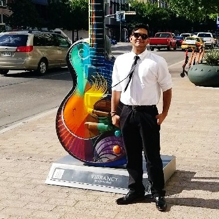

# 🤝 Meet the Devs

For sake of transparency, Telesto will respect the wishes of each individual developer and honor their wish to doxx or to remain anonymous. Thus, we will, for the time being, have a mixture of doxxed and undoxxed developers.

Stuart Gardner, Co-founder, also know as Satyrn is a developer and artist from Massachusetts and has over 4 years development experience working with several frontend and backend frameworks He also is 3d artist and blender fanatic.&#x20;


[https://www.linkedin.com/in/stuarttgardner/](https://www.linkedin.com/in/stuarttgardner/)


Jupityr, Co-founder, is a software developer with over 10 years of experience in developing on enterprise-level and personal projects. He has shipped several apps to both the Apple and Google Play store and is also a successful nft artist and developer within the larger crypto community.

Abhi Tiwari, is a full time software developr, digital marketer, and semi co-founder who goes by "Mars" in the Discord.

